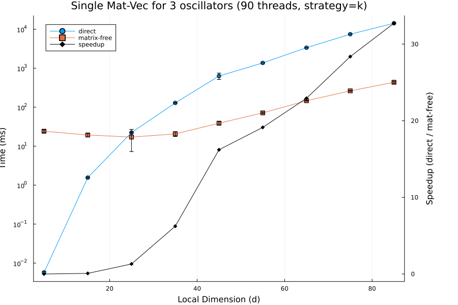
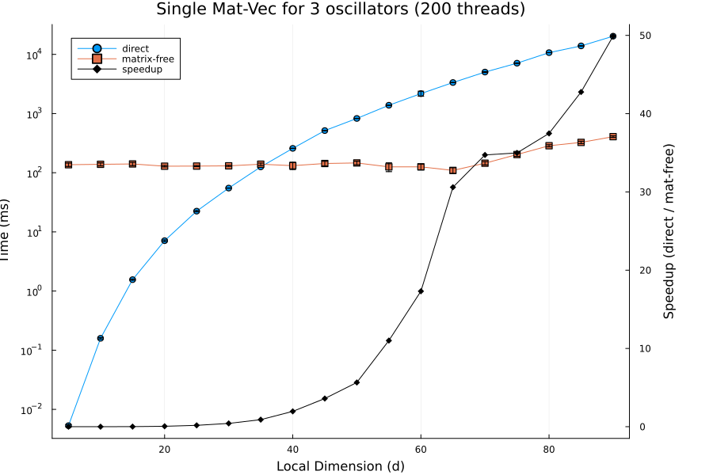

# MatrixFreeCircuitQED.jl

In development package for matrix free simulations of highly coupled circuit QED systems made of nonlinear inductors, linear inductors, and linear capacitors.

This package is currently an active, early-stage proof of concept. It was developed to address specific memory and performance bottlenecks encountered when simulating highly coupled, multi-mode superconducting circuits.

Only a proof of concept script is present. Full development will begin late spring/early summer 2026.

# Objective and Core Principal

MatrixFreeCircuitQED.jl aims to be a high-performance, GPU-accelerated package for constructing and studying superconducting circuit systems made of nonlinear inductors, linear inductors, and linear capacitors. It will be particularly useful when simulating the continuous-time evolution of strongly coupled superconducting qudits (such as the fluxonium molecule or soft 0−π qubit) where a large local Hilbert space dimension is required for accurate modeling.

The core principal is to avoid the assembly of global sparse or dense Hamiltonian matrices using the "Vec Trick" and Tensor Contractions.

Traditional quantum simulators construct the global Hamiltonian using Kronecker products and rely on Sparse Matrix-Vector (SpMV) operations to step the state forward in time. However, for highly coupled, high-dimensional qudits, the system is sufficiently dense that the problem becomes unfeasible.

MatrixFreeCircuitQED.jl bypasses this by using vector tensor contractions. We reshape the length 1D state vector into an N-dimensional tensor. Applying local operators to this state is then achieved mathematically via the "vec trick"

$$(B^T \otimes A){\rm vec}(X)={\rm vec}(AXB)$$

There are a few key advantages. First the massive D×D global matrix is never constructed, and matrix vector products can be done entirely with pre-allocated arrays. Second, the problem becomes easily parallelizable, over both CPU and GPU architectures. For the GPU operations, the tensor contraction can compile down to small batched matrix multiplications of the local operators, maximizing arithmetic intensity.

# Vision: Open System Dynamics via Batched MCWF

A primary goal of this package is to allow for the simulation of large open quantum systems. While the Lindblad master equation provides a deterministic description of dissipation, tracking the full density matrix requires $O(N^2)$ memory, which quickly becomes impossible for multi-mode circuits.

Instead, MatrixFreeCircuitQED.jl is designed to leverage the Monte-Carlo Wave-Function (MCWF) method. Monte Carlo wave-function methods scale as the wave-function dimension. Furthermore, because individual MCWF trajectories are completely independent, this matrix-free approach allows for "embarrassing parallelism." We can batch many independent stochastic state vectors into a single GPU.

# Integration with QuantumToolbox.jl and SciML

This package does not aim to reinvent or re-implement time-evolution algorithms. Rather, it is designed to act as a high-performance backend that integrates into the broader julia ecosystem.

MatrixFreeCircuitQED.jl integrates directly with QuantumToolbox.jl by overloading the mul! operator and satisfying the AbstractQuantumObject interface. This integration straightforwardly enables gradient-based optimization for time evolution using automatic differentiation. Note: sparse eigenvalues do not currently support automatic differentiation, so custom gradient rules would be required for differentiable diagonalization. 

# Initial Benchmarks & Minimal Example

A simple minimal example is included in basic_integration_test.jl. A custom tensor contraction is implemented for a system of three highly coupled oscillators with local dimension $d$. The script defines a custom AbstractQuantumObject with the overloaded mul! operator. Consistency in indexing, matrix vector products, time evolution, and diagonalization are verified versus a full instantiation of the system Hamiltonian.

In mat_vec_product_plot.jl, we perform a simple benchmark on the matrix vector product operation. As seen in the blow plot, we see an approximately 20-30x speedup in the matrix vector product for systems with local dimension of d. Note this is a CPU-CPU comparison, no GPUs have been used yet. We compare two different methods for CPU parallelization, one which parallelizes over one dimension of the contraction (uses up to $d$ threads) and one which parallelizes over the first two dimensions (uses up to $d^2$ threads). They both provide large speedups, but the two dimension parallelization offers faster performance for higher dimensions (50x at $d=90$) at the cost of higher overhead.

 